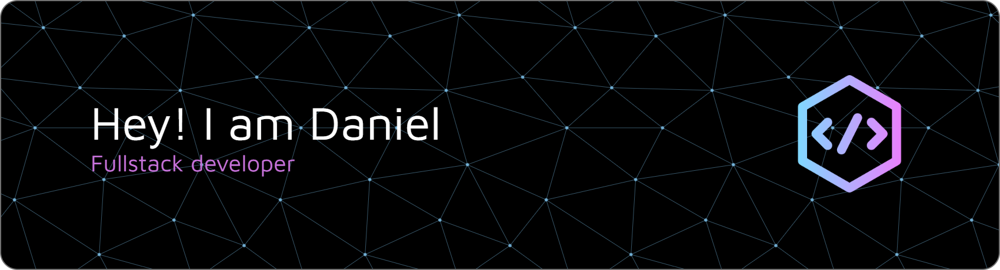

## 🗺️ My Journey
I began coding in 2024 and quickly discovered a deep passion for building real-world projects. Since then, I’ve spent my spare time learning and improving every day, focusing on both frontend and backend development.

In autumn 2025, I’ll begin a bachelor’s degree in Computer Science and Engineering at Høgskulen på Vestlandet in Bergen, Norway.

## 🛠 Skills & Technologies
#### Currently working with:
- JavaScript • TypeScript
- Python • C • Go
- SQL • PostgreSQL
- Node.js • Express.js
- React • Vite
- HTML • CSS • Tailwind CSS
- Git • GitHub • Postman

#### Future learning goals:
- C# / .NET
- **Cloud architecture** (AWS / Azure)
- **CI/CD workflows** with GitHub Actions
- ✅ **Docker** for containerization 
- **Kubernetes** for orchestration and scaling

## 🚀 What I'm Working On
### HANDL
I'm building HANDL, a full-stack web app that helps users create, manage, and share shopping lists in real time. Whether you're planning groceries solo or coordinating with family, HANDL keeps everything in sync across devices. 

Focusing on:
- Authentication & session management (Passport.js)
- RESTful API design
- Responsive UI & clean UX in React
- Real-time updates with Server-Sent Events (SSE)
- Deployment & hosting (launch coming soon!)

### Date-Knight
A lightweight date generator, arranging the perfect date with just a click. With curated activities in different categories, Date-Knight is tailored to four of the major cities in Norway. 

Focusing on:
- A lightweight backend built on Flask
- UI design with Tailwind CSS
- Type safety using Typescript with React + Vite
- A possible collaboration with various local businesses 

## 📚 Learning Philosophy
I learn by building. I’m not afraid to take on difficult challenges, in fact I thrive on them. I believe the higher the skill cap, the more rewarding the journey. I’m committed to putting in the time and effort to improve, one project at a time.

I aim to write clean, maintainable code and follow best practices while finding practical solutions.

Resources I’ve used:
- Boot.dev
- CS50 (Harvard)
- The Odin Project
- Udemy Courses

## 💡 What Drives Me
I'm motivated by solving problems, continuous improvement, and seeing ideas come to life through code. Each project teaches me something new, from writing better logic to structuring apps and designing interfaces.

I’m curious, driven, and always striving to push myself forward.
